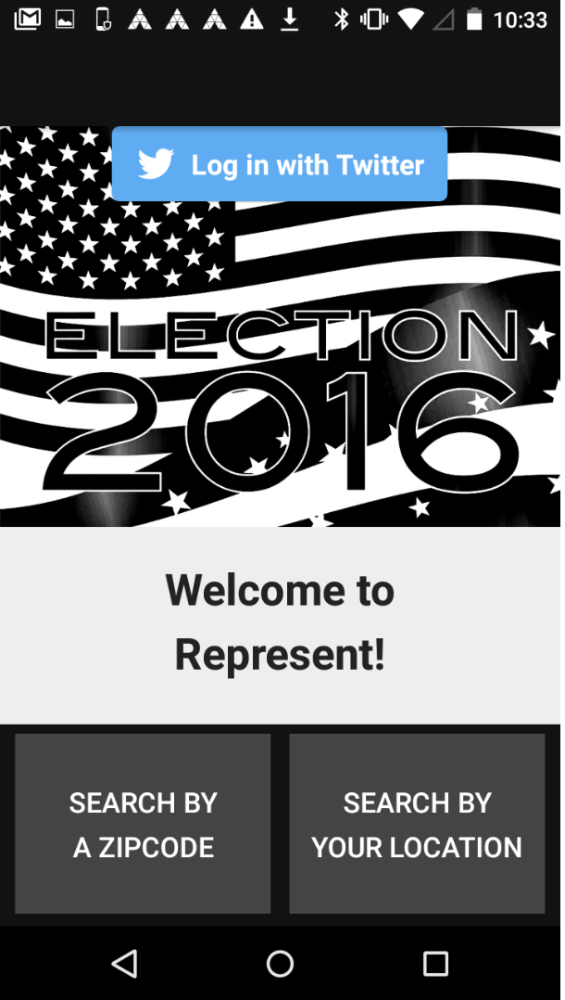

# PROG 02: Represent!

This is an Android phone/wear app to show the senators and representatives of a given area. Users can search the members by zipcode, current location, or random location. Users can also check details of the members, and check the 2012 voting result in that location.

Please note that due to network issue, sometimes the twitter data cannot be loaded. This is reported in the writeup and also recorded in the video.

## Authors

Yanrong Li ([yanrong.li@berkeley.edu](mailto:yanrong.li@berkeley.edu))

## Demo Video

See [CS260HW2_C ] (https://youtu.be/JUgP5qG_f_I)

## Screenshots

## Acknowledgments

* Got some help from stackoverflow
